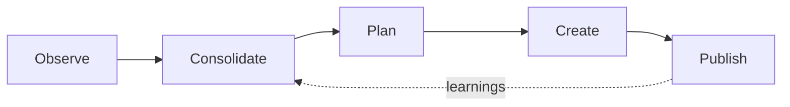
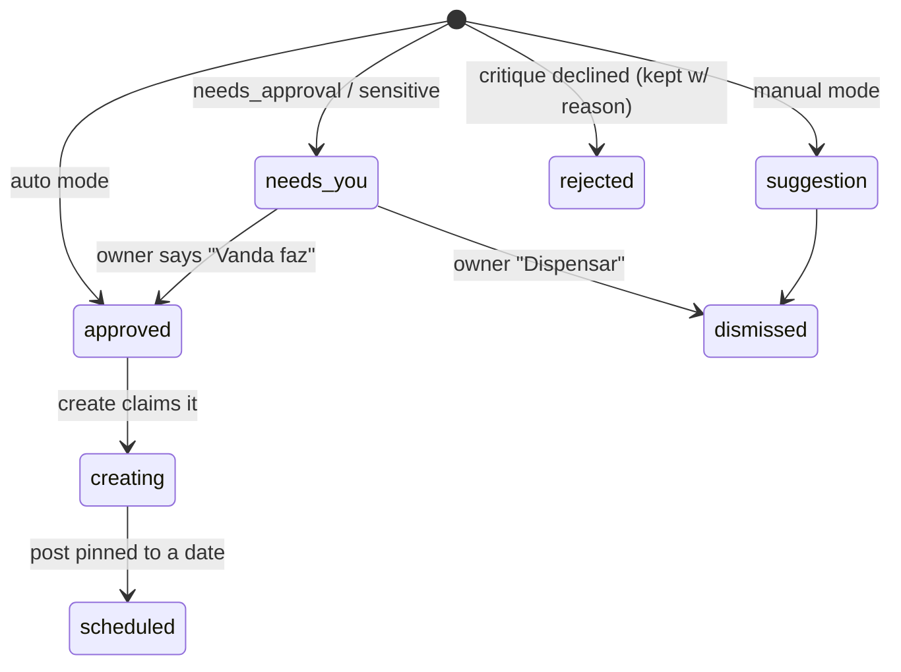
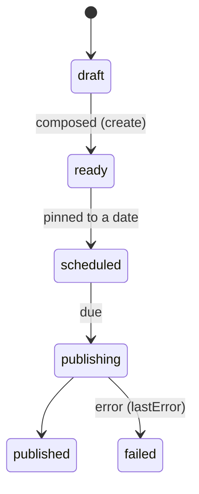

# How Vanda works — the autonomous pipeline

A map of the backend the UI sits on top of. Vanda runs a continuous four-stage
loop in the background, surfaces only what matters, and lets the owner inspect
or interrupt any item. This doc is for scaffolding the product surfaces — it
covers the flow, the entities, the states things move through, and which data
each screen reads + which controls it exposes.

> Everything here is built and proven live end-to-end (4 comments → 2 composed
> posts) **except** the UI surfaces and the Assistente. See _Real vs placeholder_.

---

## 1. The loop

The pipeline is **conceptual** — the user never triggers a stage. It runs as a
continuous background loop; the user watches it and intervenes per item.

| Stage           | What happens                                                                                              | Output                             | Cadence      |
| --------------- | --------------------------------------------------------------------------------------------------------- | ---------------------------------- | ------------ |
| **Observe**     | Ingest IG webhooks for live comments/@mentions, plus cron-pull recent IG signals as backfill; dedup + persist | `signals`                          | webhook + every 30 min |
| **Consolidate** | LLM folds new signals into belief/theme memory (reinforce / decay / contradict); writes a journal note    | `beliefs`, `themes`, `memoryNotes` | hourly       |
| **Plan**        | LLM generates post ideas from well-evidenced beliefs, then a skeptical critique accepts/rejects each      | `suggestions`                      | daily        |
| **Create**      | Durable workflow: retrieve brand context (RAG) → caption + image prompts → generate images → compose post | `posts`, `images`                  | hourly       |
| **Publish**     | Pin a post to a date → IG Graph container → poll → publish                                                | `scheduledPosts`                   | on schedule  |

**Key idea — perception is split from deliberation.** A raw signal can never
directly cause a post. Consolidate turns signals into _beliefs_ (with
confidence + evidence); only beliefs that cross an evidence threshold reach
Plan. This is why a single "someone mentioned a dog" comment doesn't spawn a
dog post — it nudges a belief; sustained evidence across signals is what posts.

---

## 2. How it actually runs

- **Convex** is the substrate: every stage reads/writes tables; the UI reads
  the same tables **reactively** (live-updating, no polling).
- **Webhooks + crons** drive observation: Instagram comment/@mention webhooks make `/automatico` feel live, while the 30-minute observe cron reconciles/backfills recent media/tags. The later stages still run on crons (see cadences above), each per-account.
- **Create is a durable workflow** (`@convex-dev/workflow`): each image is its
  own checkpointed, retried step — a failed image never redoes the caption.
- **LLM** calls go through OpenRouter (`gpt-4o-mini`); deliberation is
  generate-then-critique so the model doesn't rationalize its own ideas.
- **Memory is the moat**: beliefs/themes are queryable, editable rows — the
  owner can correct what Vanda believes, and planning instantly respects it.

---

## 3. Domain model

Account-scoped tables. `*` = the fields a screen most likely renders.

| Entity            | Key fields                                                                                                                          | Notes                                                                           |
| ----------------- | ----------------------------------------------------------------------------------------------------------------------------------- | ------------------------------------------------------------------------------- |
| **account**       | `mode`\*, `connectionId`                                                                                                            | the autonomy setting (see §4)                                                   |
| **signal**        | `source`_, `text`_, `authorHandle`, `permalink`, `observedAt`\*, `consolidatedAt`                                                   | raw observation; `source ∈ comments · mentions · competitors · trends · posts`  |
| **belief**        | `statement`_, `kind`_, `confidence`_, `status`_, `supportingSignalIds`, `confidenceAsOf`                                            | what Vanda holds; `kind ∈ audience · product · competitor · sentiment · trend`  |
| **theme**         | `name`_, `summary`_, `momentum`\*, `postCount`, `signalCount`                                                                       | recurring topic; `momentum ∈ rising · steady · falling`                         |
| **memoryNote**    | `note`_, `signalCount`, `createdAt`_                                                                                                | "what Vanda is thinking" journal, one per consolidation                         |
| **suggestion**    | `title`_, `rationale`_, `themeName`_, `format`, `status`_, `beliefStatements`, `signalIds`, `requiresApproval`_, `rejectionReason`_ | a post idea + its provenance + control status                                   |
| **image**         | `origin`_, `externalUrl`/`storageId`_, `prompt`, `width`/`height`                                                                   | atomic media unit; `origin ∈ generated · uploaded · gallery`                    |
| **post**          | `type`_, `imageIds`_, `caption`_, `status`_, `platform`, `suggestionId`                                                             | composed media; `type ∈ feed · reel · story · tweet · image`                    |
| **scheduledPost** | `scheduledFor`_, `status`_, `externalPostId`, `lastError`                                                                           | a post pinned to a date; `status ∈ scheduled · publishing · published · failed` |

**Composability**: an image is one unit; a post composes an _ordered set_ of
images + caption + platform. An image can be generated, uploaded, or pulled
from the gallery — all interchangeable.

**Provenance chain** (great for "why is this here?" UI):
`post.suggestionId → suggestion.beliefStatements / signalIds → beliefs → signals`.

---

## 4. Control model — the heart of the UX

Autonomy is **per account** and control is **per item** — never "approve the
whole pipeline."

**Account mode** (`account.mode`):

| mode             | behaviour                                                   |
| ---------------- | ----------------------------------------------------------- |
| `auto`           | Vanda creates + schedules on its own; ideas land `approved` |
| `needs_approval` | ideas land `needs_you` and wait for the owner               |
| `manual`         | ideas land as `suggestion`; the owner drives                |

**Suggestion lifecycle** (`suggestion.status`):

- `rejected` rows **stay visible** with their `rejectionReason` — inspectable
  autonomy ("Vanda considered a dog post but skipped it — only 2 mentions").
- Sensitive ideas (negative sentiment, competitors, anything risky) always
  enter `needs_you`, regardless of mode.

**Per-item actions** (the canonical control surface — map to transitions):

| Action                | Meaning              | Transition                 |
| --------------------- | -------------------- | -------------------------- |
| **Vanda faz**         | hand it to Vanda     | → `approved` → create runs |
| **Eu faço / Assumir** | owner takes it over  | → owner composes (manual)  |
| **Dispensar**         | dismiss              | → `dismissed`              |
| **Precisa de você**   | flagged for approval | `needs_you`                |

> The read side (list suggestions/beliefs/posts) exists today. The
> owner-triggered mutations (dismiss, take-over, approve-from-`needs_you`) are
> wired alongside the screens that expose them.

---

## 5. Screen ↔ data ↔ controls

The pipeline lives in the backend; the user navigates a handful of surfaces over
it. (Sidebar: Início · Automático · Assistente · Galeria · Calendário · Perfil.)

| Screen                | Reads                                                                      | Renders                                                                                                                                                 | Controls                                                       |
| --------------------- | -------------------------------------------------------------------------- | ------------------------------------------------------------------------------------------------------------------------------------------------------- | -------------------------------------------------------------- |
| **Automático** (live) | `signals` (recent, by source), `suggestions` (newest-first), `memoryNotes` | "Observando agora" feed (each source + latest item + time); "O plano da Vanda" cards: trigger → idea → destination + status badge; the thinking journal | per-item: Vanda faz · Eu faço · Dispensar; account mode toggle |
| **Galeria**           | `posts`, `images`                                                          | masonry grid, filterable by type (Tudo · Posts · Imagens · Reels · Stories · Tweets) with counts; every card has **Editar**                             | create ("Ask Vanda"), batch-gen, Editar (contextual chat)      |
| **Calendário**        | `scheduledPosts` + `posts`                                                 | posts pinned to dates; auto-scheduled suggestions appear here                                                                                           | drag to (re)schedule → publish                                 |
| **Perfil**            | `account.mode`, `beliefs`, `themes`                                        | "what Vanda knows" — beliefs (confidence/status), themes (momentum); the autonomy setting                                                               | toggle mode; **correct/retire a belief** (the trust feature)   |
| **Assistente**        | conversations (Phase 7)                                                    | generalist chat doing tool-calls over all of the above                                                                                                  | natural-language everything                                    |

**Design notes that fall out of the model**:

- A suggestion card _already carries everything it needs_: the **trigger**
  (`signalIds` → the comments), the **idea** (`title` + `rationale`), the
  **destination** (`themeName`, `format`), the **status**, and — when rejected —
  the **reason**. No extra fetch to explain a card.
- The Automático feed and the suggestion cards update **live** as crons run —
  the "ao vivo" indicator is real, not faked.
- `memoryNotes` is the narration layer ("Vanda is noticing…") for the calm,
  Linear-style ambient view.

---

## 6. Post lifecycle (for Galeria + Calendário)

Create emits posts at `ready`. Publish drives `scheduled → publishing →
published/failed` and records the `externalPostId` (the calendar's source of
truth is the `scheduledPost.status`).

---

## 7. Real vs placeholder

When mocking screens, know what's live vs scaffolded:

| Piece                                      | State                                                                                                 |
| ------------------------------------------ | ----------------------------------------------------------------------------------------------------- |
| observe → consolidate → plan → create loop | **real**, runs live on crons                                                                          |
| belief reinforcement / decay / thresholds  | **real** (pure, property-tested)                                                                      |
| plan generate-then-critique (+ rejections) | **real** (live, with reasons)                                                                         |
| create durable workflow + compose          | **real** (live)                                                                                       |
| RAG context retrieval                      | **real but lexical** (vector swap is a port away)                                                     |
| image generation                           | **placeholder** (on-brand SVG; real AI generator is a port away — won't be IG-publishable until then) |
| observe pulling from real Instagram        | built + tested; **needs a connected IG account** to run live                                          |
| observe receiving Instagram webhooks       | built; requires Meta Webhooks setup, live app, advanced access for comment webhooks, and `INSTAGRAM_WEBHOOK_VERIFY_TOKEN` |
| publish to Instagram                       | built; **not run live** (destructive; needs hosted images)                                            |
| the screens above + Assistente             | **not built yet** — this doc is the spec to build them against                                        |

---

## 8. Where the code lives

- Pipeline logic (pure + Effect programs): `apps/vanda/src/convex/pipeline/`
  (`domain.ts`, `memory.ts`, `discernment.ts`, `consolidate.ts`, `plan.ts`,
  `create.ts`, `retrieval.ts`, `publish.ts`, `publisher.ts`).
- Convex functions (queries/mutations/actions/workflow): `apps/vanda/src/convex/`
  (`observe.ts`, `consolidate.ts`, `plan.ts`, `create.ts`, `publishScheduled.ts`).
- Schema: `apps/vanda/src/convex/schema.ts`. Shared literal sets:
  `pipeline/constants.ts`. Crons: `crons.ts`.
